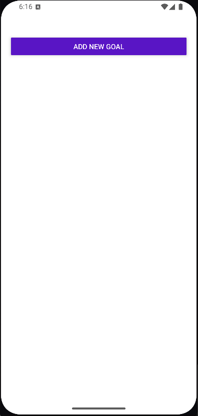
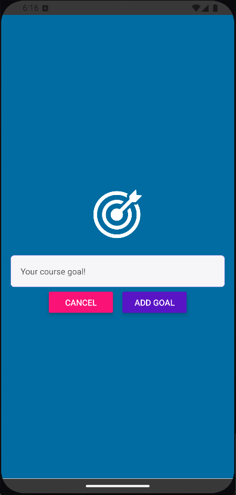
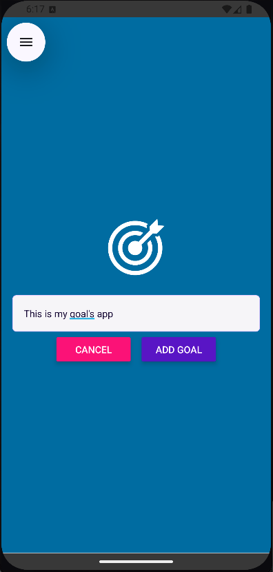
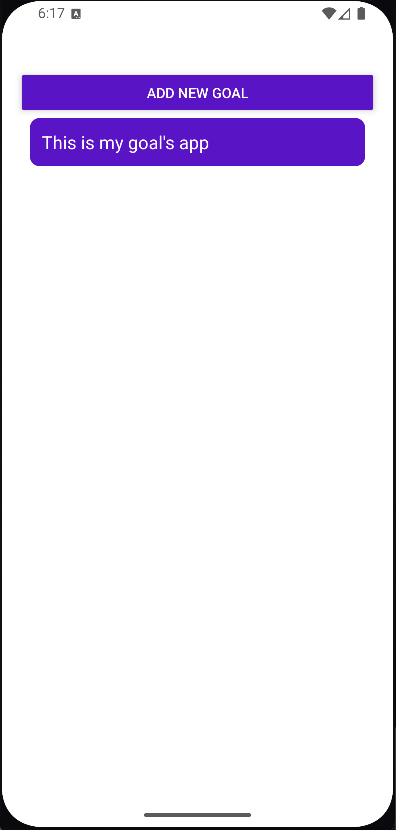

# Goal App

You can add goals

## Screenshots

<table>
  <tr>
    <td></td>
    <td></td>
    <td></td>
    <td></td>
  </tr>
  <tr>
    <td align="center">Empty state</td>
    <td align="center">Input Screen</td>
    <td align="center">Adding Goal</td>
    <td align="center">Goal list</td>
  </tr>
</table>

## Getting Started

1. Install dependencies

```bash
   npm install
```

2. Start the development server

```bash
   npx expo start
```

3. Run on your platform of choice from the Expo CLI output:
   - Press `a` for Android emulator
   - Press `i` for iOS simulator
   - Scan the QR code with Expo Go on a physical device

## Building an APK

This project uses [EAS Build](https://docs.expo.dev/build/introduction/) to generate installable Android builds.

```bash
eas build --platform android --profile preview
```
